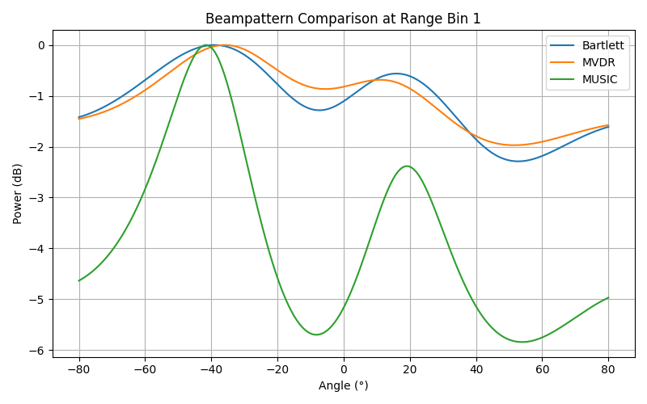

# Beamforming-with-Infineon-BGT60TR13C

## Infineon BGT60TR13C Beamforming Pipeline

This repository contains a complete **beamforming pipeline** for the Infineon **BGT60TR13C** FMCW radar. This also helps understanding the beamforming limitations on compact FMCW radars like Infineon **BGT60TR13C**.

The goal of this project is to:
- Understand **classical and adaptive beamforming** using real radar data
- Highlight **fundamental limitations** of small-form-factor mmWave radars for beamforming


## 1. Repository Structure

```
BEAMFORMING/
├── beamformers/
│   ├── bartlett.py
│   ├── bartlett_ver2.py
│   ├── mvdr.py
│   ├── music.py
│   ├── compare_all.py
│   └── compare_all_advanced.py
│
├── io_loader.py
├── array_geometry.py
├── radar.npy
├── beamforming_data/
│   ├── 2_reflectors_*/
│   └── 3_reflectors_*/
└── README.md
```
## Results
.png)

.png)

.png)

.png)


## 2. Processing Pipeline 

### Data Loading (`io_loader.py`)

- Load raw ADC data from `radar.npy`
- Expected shape:

```
[N_CPI, N_RX, N_chirps, N_samples]
```

- Extract one CPI (coherent processing interval)


### Range Processing (`preprocess_frame()`)

For each RX channel:
1. DC removal (per chirp)
2. Windowing (Hanning)
3. FFT along fast-time
4. Keep positive frequencies

Output cube:
```
[range_bins, chirps, rx]
```

This isolates **range information** before any angular processing.

### Spatial Covariance Estimation

For a fixed range bin $r$, spatial beamforming operates on the sample covariance matrix formed from RX snapshots across slow time:

$$
\mathbf{R}(r) =
\frac{1}{N}
\sum_{n=1}^{N}
\mathbf{x}_n(r)\, \mathbf{x}_n^H(r),
$$

where

- $\mathbf{x}_n(r) \in \mathbb{C}^{M \times 1}$ is the RX snapshot vector at chirp index $n$ for range bin $r$,
- $M$ is the number of RX antennas (here $M=3$),
- $N = (\text{number of chirps}) \times (\text{number of CPIs})$ is the total number of snapshots used,
- $(\cdot)^H$ denotes the Hermitian (conjugate transpose).

This covariance matrix captures the **spatial correlation** between RX channels and is the fundamental input to all beamforming and DOA estimation methods used in this project.


## 3. Beamforming Methods used

### 3.1 Bartlett (Conventional Beamforming)

The Bartlett beamformer computes the output power obtained by steering the array toward angle $\theta$ and projecting the received spatial covariance onto that direction. It can be interpreted as measuring **how much signal energy arrives from a given angle** without attempting to suppress interference or noise. Because the same steering vector is used for both transmit and receive weighting, Bartlett beamforming is sometimes referred to as **conventional** or **delay-and-sum** beamforming.

**Key properties:**

- Non-adaptive: the weights do not depend on the interference environment
- Always stable (no matrix inversion required)
- Produces smooth, continuous range–angle maps
- Angular resolution is limited by the physical aperture of the array

**Good for:**

- Low-SNR scenarios where adaptive methods may become unstable  
- Visualization and debugging of range–angle behavior  
- Baseline or sanity-check comparisons against more advanced methods  

**Not Good for:**

- Closely spaced targets (poor angular separation)
- Strong interference or multipath environments
- High-resolution direction-of-arrival estimation


**Practical note for this radar:**

With only three RX elements on the Infineon BGT60TR13C, Bartlett beamforming provides reliable but coarse angular information and serves primarily as a **reference method** rather than a high-resolution DOA estimator.


### 3.2 MVDR / Capon Beamformer

**Optimization problem:**

The Minimum Variance Distortionless Response (MVDR), also known as the Capon beamformer, designs spatial weights by solving

$$
\min_{\mathbf{w}} \; \mathbf{w}^H \mathbf{R} \mathbf{w}
\quad \text{s.t.} \quad
\mathbf{w}^H \mathbf{a}(\theta) = 1,
$$

where $$\mathbf{R}$$ is the spatial covariance matrix and $$\mathbf{a}(\theta)$$ is the steering vector corresponding to look direction $\theta$.

The constraint enforces **unit gain** in the desired direction, while the objective minimizes the total output power contributed by noise and interference from all other directions.

**Beamforming spectrum:**

The resulting MVDR spatial spectrum is given by

$$
P_{\text{MVDR}}(\theta) = \frac{1}{\mathbf{a}^H(\theta)\,\mathbf{R}^{-1}\,\mathbf{a}(\theta)}
$$


Large values of $$P_{\text{MVDR}}(\theta)$$ indicate directions that are consistent with the observed covariance structure while minimizing interference.

Unlike Bartlett beamforming, MVDR is an **adaptive beamformer**. The beamformer weights depend explicitly on the estimated covariance matrix, allowing the array to place **spatial nulls** in the directions of strong interferers while preserving signals arriving from the look direction.

In effect:
- Bartlett *listens everywhere equally*
- MVDR *listens carefully and suppresses unwanted directions*


**Enhancements used in this implementation:**
- **SNR-aware diagonal loading:**  
  Because the covariance matrix is estimated from a finite number of snapshots, it may be ill-conditioned or nearly singular. A data-driven diagonal loading term is added to $$\mathbf{R}$$ before inversion to improve numerical stability, especially in low-SNR or low-snapshot regimes.

**Good for:**

- Suppression of strong interferers or clutter
- Improved angular selectivity compared to Bartlett
- Moderate-resolution DOA estimation when covariance estimation is reliable

**Not Good for:**

- Poor covariance estimation (few snapshots or rapidly changing scenes)
- Very low snapshot counts
- Highly correlated sources or severe multipath environments

**Practical note for this radar:**

With only three RX antennas on the Infineon BGT60TR13C, MVDR can provide visibly sharper beams than Bartlett, but its performance is still fundamentally limited by the small array aperture and the quality of covariance estimation.

### 4.3 MUSIC (Subspace Method)
The MUltiple SIgnal Classification (MUSIC) algorithm exploits the **orthogonality between the signal subspace and the noise subspace** of the spatial covariance matrix.

**Subspace decomposition:**
After eigenvalue decomposition of the spatial covariance matrix,

$$
\mathbf{R} = \mathbf{E}_s \boldsymbol{\Lambda}_s \mathbf{E}_s^H + \mathbf{E}_n \boldsymbol{\Lambda}_n \mathbf{E}_n^H,
$$

where

- $$\mathbf{E}_s$$ contains the eigenvectors associated with the dominant (signal) eigenvalues,
- $$\mathbf{E}_n$$ contains the eigenvectors associated with the smaller (noise) eigenvalues,
- $$\boldsymbol{\Lambda}_s$$ and $$\boldsymbol{\Lambda}_n$$ are diagonal matrices of signal and noise eigenvalues, respectively.

**MUSIC spatial spectrum:**

The MUSIC pseudospectrum is defined as

$$
P_{\text{MUSIC}}(\theta) = \frac{1}{\left\|\mathbf{E}_n^H \mathbf{a}(\theta)\right\|^2},
$$

where $$\mathbf{a}(\theta)$$ is the steering vector for angle $\theta$.

At a true direction of arrival (DOA), the steering vector lies entirely within the signal subspace and is therefore orthogonal to the noise subspace, causing the denominator to approach zero and producing a sharp peak.

Unlike Bartlett and MVDR, MUSIC **does not estimate power**. Instead, it measures how well a candidate steering vector aligns with the estimated signal subspace.

As a result:
- Peaks in the MUSIC spectrum correspond to candidate DOAs
- Peak heights do **not** represent signal strength
- Very sharp peaks are expected even for weak targets

MUSIC is a **super-resolution** method and can resolve angular separations smaller than the classical beamwidth—provided the underlying assumptions are satisfied.

**Enhancements used in this implementation:**

- **Forward–backward averaging:**  
  Improves subspace estimation for uniform linear arrays and partially mitigates coherent multipath effects.

- **Automatic source-number estimation (MDL / AIC):**  
  Information-theoretic criteria are used to estimate the number of signal sources from the eigenvalue structure of $\mathbf{R}$.

- **Diagonal loading:**  
  Stabilizes eigenvalue decomposition in the presence of noise and limited snapshot support.
  
**Good for:**

- High angular resolution in well-modeled environments
- Educational demonstrations of subspace-based DOA estimation
- Scenarios with sufficient snapshots and uncorrelated sources

**Not Good for:**

- Small arrays (e.g., $$\leq 3$$ RX elements)
- Strong multipath or highly correlated sources
- Model mismatch (near-field targets, calibration errors, array imperfections)

**Critical limitation for this radar:**

With $M=3$ RX antennas, the maximum number of resolvable sources is $M-1=2$. When more physical reflectors or multipath components are present, MUSIC will produce additional peaks and blobs that should **not** be interpreted as distinct targets. So to summarise--

with infineon radar we used, having one target works very good, having two of them still works good, but having more than 3 and if they are very close to each other, the algorithm fails, not due to the algorithms rather  due to the hardware limitations of infineon BGT60TR13C.


## 5. Angle Convention

This project follows a **standard uniform linear array (ULA) azimuth convention**:

- **$$0^\circ$$** corresponds to **boresight**, i.e., the direction normal (perpendicular) to the radar front.
- **Positive angles ($+\theta$)** correspond to targets located on the **right-hand side of the radar**.
- **Negative angles ($-\theta$)** correspond to targets located on the **left-hand side of the radar**.

This convention is entirely determined by the **steering vector phase progression** used in the beamforming implementation.

### Steering vector phase model

For RX element index $m = 0, 1, \dots, M-1$, the steering vector phase term is

$$
\phi_m(\theta) = 2\pi \frac{m d}{\lambda} \sin(\theta),
$$

where

- $$d$$ is the inter-element spacing,
- $$\lambda$$ is the wavelength,
- $$\theta$$ is the azimuth angle measured from boresight.

A positive value of $$\sin(\theta)$$ produces a **positive phase progression** across increasing RX indices, which corresponds to a target on the right side of the array under this convention.

**Important note:**  
Angle sign conventions are not universal and depend entirely on the steering vector definition and RX indexing. When comparing results across different toolchains, always verify the underlying array geometry and phase convention.


## 6. Infineon BGT60TR13C: Fundamental Limitations for Beamforming

While the Infineon BGT60TR13C is well-suited for short-range sensing and basic angular awareness, it has several **fundamental hardware limitations** that significantly constrain beamforming and high-resolution DOA estimation.

These limitations are architectural and cannot be overcome purely through signal processing.

### 6.1 Extremely Small Array Aperture

The radar provides only **$$M = 3$$ RX antenna elements**, forming a very small uniform linear array.

The achievable angular resolution is fundamentally limited by the array aperture and can be approximated as

$$
\Delta \theta \approx \frac{\lambda}{M d},
$$

where $$d$$ is the inter-element spacing and $\lambda$ is the wavelength.

With only three elements:
- The mainlobe is inherently wide
- Closely spaced targets cannot be reliably separated
- Sidelobes are high and poorly controlled

As a result, all beamforming methods on this platform are **aperture-limited**, regardless of algorithmic sophistication.

### 6.2 No Virtual Array Capability

The BGT60TR13C operates as a **single-TX, multi-RX radar**:

- Only one transmit antenna
- No time-division multiplexing (TDM-MIMO)
- No phase diversity across transmit channels

Because of this:

- There is no way to synthesize additional virtual antenna elements
- The effective array size is fixed at three physical RX channels
- Classical MIMO-based virtual array expansion is **not possible**

**Virtual channels cannot be created on this hardware platform.**

This fundamentally limits the maximum resolvable number of sources and achievable angular resolution.

### 6.3 Near-Field and Model Mismatch Effects

Many practical targets sensed by the BGT60TR13C are located at short ranges, where the **far-field (plane-wave) assumption** may not strictly hold.

Subspace-based methods such as MUSIC assume:
- Far-field propagation
- Plane-wave arrivals across the array
- Spatially stationary phase progression

When these assumptions are violated:
- Steering vectors become mismatched
- Subspace separation degrades
- Spurious peaks appear in the MUSIC spectrum

This effect is especially pronounced in indoor and laboratory environments.

### 6.4 Mutual Coupling and Calibration Uncertainty

Due to the compact antenna layout:

- RX elements are closely spaced
- Mutual coupling between antennas is non-negligible
- Element patterns deviate from ideal isotropic responses

Additionally:
- No factory-provided calibration matrix is available
- Phase and gain mismatches between RX channels are uncorrected

These effects distort the true array manifold, reducing the accuracy of both adaptive and subspace-based beamformers.

### Practical implication

Because of the combined effects above, the BGT60TR13C should be viewed as:

- **Unsuitable for high-precision beamforming**
- **Marginal for subspace methods such as MUSIC**
- **Well-suited for educational demonstrations, prototyping, and qualitative angular awareness**

High-resolution DOA estimation generally requires:
- Larger arrays
- MIMO virtual apertures
- Careful calibration
- Controlled propagation environments


## 7. When This Radar *Is* Useful

- Range–Doppler analysis
- Micro-Doppler
- Motion detection
- Gesture sensing
- Educational beamforming demos


## 9. When It Is *Not* Suitable

- High-resolution DOA
- Multi-target angular separation
- SAR / MIMO beamforming
- Automotive-grade angle estimation

## Final Takeaway

> **Infineon BGT60TR13C is excellent for learning beamforming, but fundamentally limited for high-quality angular estimation.**


Author: Sultanus Salehin

